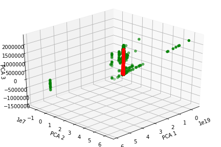
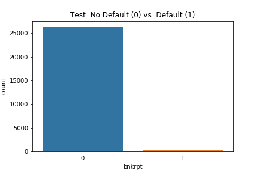
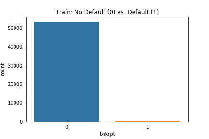

[](http://quantlet.de/)

## [](http://quantlet.de/) **SDA_2019_St_Gallen_PD_with_ML_and_Sentiment_Analysis_Outlier_detection_Oversampling_Feature_Selection** [](http://quantlet.de/)

```yaml

Name of Quantlet: 'SDA_2019_St_Gallen_PD_with_ML_and_Sentiment_Analysis_Outlier_detection_Oversampling_Feature_Selection'

Published in: 'SDA_2019_St_Gallen'

Description: 'Identify and remove outliers, perform oversampling, select the 44 most important features of the dataset'
            
Keywords: 'outlier detection, isolation forest, oversampling, random naive oversampling, synthetic minority oversampling, adaptive synthetic'

Authors: 'Alexander Schade, Fabian Karst, Zhasmina Gyozalyan'

Submitted:   '25 November 2019'

Input: 'bl_data_processed.csv, cf_data_processed.csv, is_data_processed.csv, lbl_data_processed.csv, filings_data_processed.csv, macro.csv, ratios.csv'

Output:  'inliers dataset, different train datasets with various oversampling methods applied, the test dataset (as csv)'

```









### PYTHON Code
```python

# -*- coding: utf-8 -*-
"""
Created on Thu Nov 21 16:54:51 2019

@author: Jasmine

Input: X_all_train_wo_OS.csv, y_train_wo_OS.csv
Output: y_all_inliers_wo_os.csv, x_all_inliers_wo_os.csv
Purpose: Detect outliers using Isolation Forest (the percentage of outliers was set to 10%). Save new cleaned datasets with inliers.
https://towardsdatascience.com/anomaly-detection-with-isolation-forest-visualization-23cd75c281e2
"""

import os
import pandas as pd 
import numpy as np
from sklearn.ensemble import IsolationForest

x_all = pd.read_csv("X_all_train_wo_OS.csv")


y_all = pd.read_csv("y_train_wo_OS.csv")

#outlier decection using IsolationForest
to_model_columns=x_all.columns[3:46]

clf=IsolationForest(n_estimators=100, max_samples='auto', contamination=float(.1), \
                        max_features = 43, bootstrap=False, n_jobs=-1, random_state=42, verbose=0)
clf.fit(x_all[to_model_columns])
pred = clf.predict(x_all[to_model_columns])
x_all['anomaly']=pred
outliers=x_all.loc[x_all['anomaly']==-1]
outlier_index=list(outliers.index)

#Find the number of anomalies and normal points here points classified -1 are anomalous
print(x_all['anomaly'].value_counts())

# matching anomalies to y-dataset
y_all['anomaly'] = 1
  
for index in outlier_index:
    y_all.iloc[index]['anomaly'] = -1 
    
# save cleaned datasets

y_all_inliers = y_all[y_all['anomaly'] == 1]
y_all_inliers = y_all_inliers.drop('anomaly', axis=1)
y_all_inliers.to_csv('y_all_inliers_wo_os.csv')

x_all_inliers = x_all[x_all['anomaly'] == 1]
x_all_inliers = x_all_inliers.drop('anomaly', axis=1)
x_all_inliers.to_csv('x_all_inliers_wo_os.csv')


```

automatically created on 2019-12-02